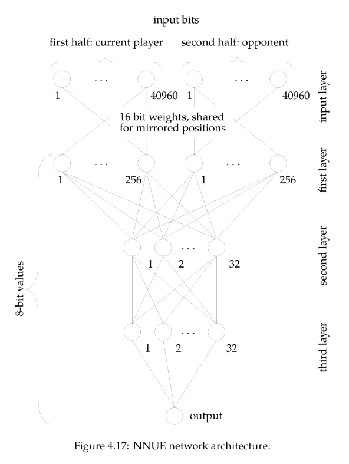

# Citation
Neural Networks for Chess The magic of deep and reinforcement learning revealed
https://arxiv.org/pdf/2209.01506
# Meta

# Notes
# 4.6
**p.194**
Output of NNUE is a single value that denotes the eval of the pos.
Input is Half-King-Piece relationship. We 'enlist all possible triples':
(own king position, own/enemy piece type, position of that piece)
And we do the same for the enemy.
This resolves to either a 0 or a 1, depending on if it is true or not. 
**p.195**
For example:
- own king on a1, own pawn on a2 is 0 when the king is not on a1 or the king is on a1 but there is no pawn on a2. Otherwise, it is 1.
**p.197**
There are therefore 81920 inputs:
- 40960 for 64 white king positions, 64 square where pieces can be, 10 types of pieces
-  40960 for 64 black king positions, 64 square where pieces can be, 10 types of pieces
This encoding has several properties:
1. Agnostic of color
2. When making a move, only a few bits of the input change, unless a king move is made
**p.198**
A more straightforward way to handle inputs is bitboards. Interestignly however, "verparameterized networks tend to learn better and generalize well."
**p.199**
In an NNUE, input bits are divided into two halves:
The first half is the bits where our own king + pieces is considered. 
The other half is the bits where their king + pieces is considered.
Then there are 256 nodes per half
Then there are 32 and 32 nodes connecting everything
**p.200**
The weights that connect the half represening ones own king to the first layer are the same that connect "the second half of the input layer to the second half of the first layer"
For example "own king on e1, own pawn on d2" and "enemy king on e8, enemy pawn on d7" have the same weight
**p.201**

**p.204**
The idea of the layers is to represent the "weights by 8 bit values so that we can use acceleration features
of modern CPUs"

## Computing value of second layer

## Computing value of input layers
**p.207**
Much of the input will be 0, which, when multiplied by weights, is still 0.
Therefore, instead of multiplying the two matrices (input and weight), we get the outcome via iteration.

**p.209**
After this is done, when the player moves a piece that isn't the king, instead of having to recalculate everything, we take the old vector, subtract the weights that are now zero due to the move, and add the weights that are now one.
